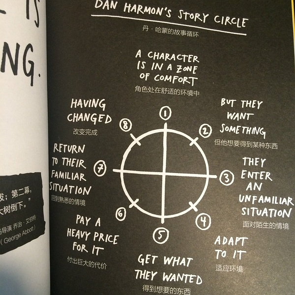
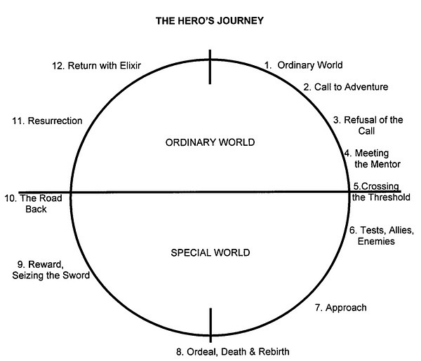
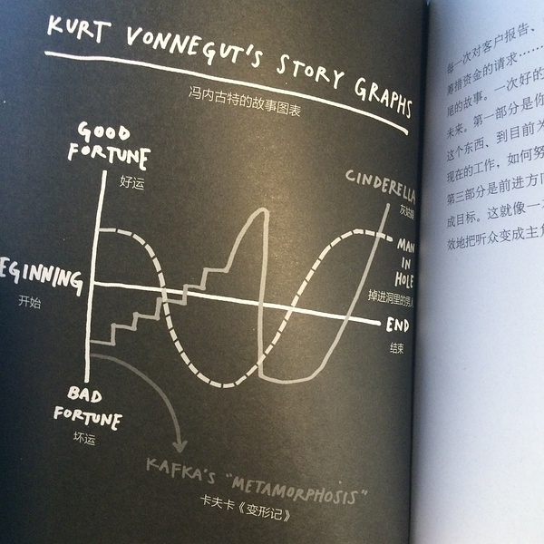

# 丹•哈蒙 Dan Harmon 的故事圈理论

根据市场的需求和观众的心理愿望，好莱坞电影的主创人员形成了一套特色鲜明的叙事谋略：

**一是讲述一个结构完整、一波三折、通俗易懂、老少皆宜的动人故事。**

好莱坞的主流电影所叙述的大多是有头有尾、有悬念、有高潮的戏剧化的故事。三个 S 的叙事原则是好莱坞电影人的发明，也是赢得票房的法宝。

所谓三个 S 的原则，即：
* 影片的开头，要给观众一个 *Surprise*（惊讶、惊喜），以便吸引观众；
* 影片的展开部，要能设置 *Suspense*（悬疑、延宕），以便留住观众；
* 影片的结尾，要给观众一个 *Satisfaction*（满足、称心），以此来慰藉、回报那些掏了钱买票的观众。

**二是编造一个似梦非梦、似真似幻的世俗神话。**

“黄金时代”的好莱坞电影不太关注现实生活，对于二十世纪三四十年代西方世界发生的一系列重大事件，如经济危机、工人失业、法西斯主义的肆虐等等，鲜有正面的反映。

有些影片，即便涉及到上述事件，也是作为背景处理。好莱坞主流电影所承载的大多是些虚幻的白日梦般的世俗神话。这与美国人把电影长期点位于商业娱乐行业有关，也与发生在好莱坞的迫害进步人士的“黑名单”事件有所关联。

**三是套用一个个经过市场验证、深受观众喜爱的叙事模式。**

经典好莱坞电影，常常给人似曾相识的感觉。从艺术的角度来说，重复和模仿之作很难入流。

但事实也已证明，某种相对固定的电影样式确实能够争取到相对稳定的观众。结合观众观看的习惯，把某种电影样式和影像特征予以强化并实施局部翻新，是好莱坞电影在叙事方面的又一个谋略。

如果说好莱坞电影人也还是有一些个性和创造精神的，那也只能在类型化电影的总体框架内追求丰富多彩了。

**四是展示几个光彩照人、容易引起观众认同感的理想化人物。**

能否让观众对银幕上的人物形象产生认同感，是决定一部影片成败的关键。

在这方面，“黄金时代”的好莱坞深谙个中三味。好莱坞电影中常见的主要人物，既不是富得流油的金融寡头，也不是一贫如洗、一无所有的劳工或农民，而是不太穷也不太富，知书达理、有点幽默感也有开拓精神的中产阶级。

对于大资产阶级，主人公会给点讽刺与调侃；对于平民阶层，主人公会给点同情与怜悯；对于法律与准则，则采取总体尊重、局部戏弄的态度。显然，这样的人物是最容易在广泛的人群中获得认同的。

有人说，好莱坞多年来推销的是中产阶级的意识形态和生活方式。但造成这个结果的原因更多的是出于商业动机，出于为了获得普遍的认同感。

叙事指的是讲故事的方法，通常是如何在时间和空间中把时间组织起来——也就是编剧和导演如何把一个股市的原始内核用最吸引人、最有趣的方法讲出来。

好莱坞关于电影的叙述有一套不成文的规定，并且诞生了一种非常精致的故事框架。叙述者看故事的角度不同，也会影响到叙述，产生相对而言的“限制型”和“非限制性”的叙述；此外，好的叙述方式必须扣人心弦、生动有力，让观众对即将发生的事件充满兴趣，我们把这称为推动力。

## 叙述、故事和情节

在分析电影的叙述结构时，叙述、故事和情节是我们使用的关键词语。虽然这些词有时可以互换，但是它们各自其实都有准确的定义，我们需要掌握其中的区别。大卫•博德威尔和克里斯廷•托马斯在《电影艺术入门》中这样定义：
* **叙述** 在时间和空间中出现的一系列有着因果关系的事件。
* **故事** 观众看见和听到的所有事件，再加上观众推断或者设想发生过的事件。
* **情节** 电影中所有直接向观众展现的事件，包括因果关系、时间顺序、持续时间、频率和地点。

故事和情节之间关键的区别在于：故事是观众对叙述中的事件建立的想象，这些事件可能在电影中出现，也可能不曾出现；而情节则是电影对叙述中的事件的真实表现。

## 基本故事类型

罗里•约翰斯顿等作家认为，所有的虚构叙述都是建立在几个基本的故事类型基础上的。这些基本故事类型是：阿喀琉斯、康迪德、灰姑娘、喀耳刻、浮士德、俄耳普斯、罗密欧与朱丽叶、特里斯坦以及流浪的犹太人。这些故事类型可以单独出现，也可以结合在一起。

我们阐述这些故事类型的时候不要过于拘泥。例如，“浮士德”讲的是一个人把灵魂出卖给了魔鬼，这个魔鬼不一定是一个真正的魔鬼，可能是一个隐喻——例如荣华富贵和功名利禄。同样，“流浪的犹太人”也很少真的指一个离开家乡的犹太人。通常来讲这是一个比较宽泛的比喻，指的是一个离开了自己的社会并永远无法真正回归的人。

### 九种基本故事类型：

1. **阿喀琉斯** “阿喀琉斯”是一个看上去无懈可击，但是却有着一个致命弱点的英雄的故事。古典悲剧通常就是阿喀琉斯故事的一个变种。（如《超人》）
2. **康迪德** 一个纯真无邪的乐天派英雄踏上陌生的土地，出人意料地大获全胜。（如《阿甘正传》、《憨豆先生》、《美丽心灵》、《印第安那•琼斯》）
3. **灰姑娘** 这是一个“梦想成真”的故事：良知与美德刚开始被轻视，最后则受到认可。灰姑娘故事的主人公出身卑贱，但是凭着良好的天性，最终感动了所有怀疑她的人，并且获得了奖励。（如《漂亮女人》）
4. **喀耳刻** 好人被坏人穷追不舍，直到好人打败了坏蛋。这个故事的形式常常是妖艳的女子施展手段迷惑被爱情冲昏了头的男人，人们生动地将之形容为“蜘蛛和苍蝇”。这是恐怖片、惊悚片和黑色电影的基本结构。（如《致命吸引力》和《异形》系列电影）
5. **浮士德** 一个把灵魂卖给了魔鬼，换得片刻的权利和富贵，但是最终必须要偿还自己欠下的债。浮士德的故事有时候还以另外一种形式出现——无法掩饰的黑暗秘密，或者一个人难以洗清的过去。（如《华尔街》）
6. **俄耳普斯** 俄耳普斯的故事是关于被夺走的幸福。这种幸福可能是个人的东西、爱人、某种能力、生命中所有重要的东西，甚至生命本身。这个故事讲的事失去幸福这个悲剧本身，或者是失去以后寻找它的过程。（如《生逢七月四日》）
7. **罗密欧与朱丽叶** 经典的“命运不佳的情侣”，在真爱的路上遇到了巨大的阻挠。（如《恋爱中的莎士比亚》和《幽灵》）
8. **特里斯坦** 三角恋爱：一男一女想爱了，但是其中一人喝另外一个人（或者一些东西）有所牵连。这个“第三方”通常是一个人，但是也有可能是某种更加抽象的东西（例如一个使命、任务，或者命运）。（如《毕业生》）
9. **流浪的犹太人** “流浪的犹太人”指的是一个被迫害或者被放逐的流浪者，他永远也无法回到家乡。（如《英国病人》和《现代启示录》）

### 《卡萨布兰卡》
有人认为，有一部电影结合了所有基本故事元素，这部电影就是《卡萨布兰卡》。

在该片中，里克是一个在第二次世界大战期间流亡到摩洛哥的酒吧老板——一个玩世不恭、并不完美的英雄（阿喀琉斯）。然后，埃尔莎来到了酒吧——她是里克的旧爱，也是他愤世和空虚的原因。

里克曾经深爱埃尔莎，他们一起在巴黎生活，但是后来却失去了他（罗密欧与朱丽叶），虽然他仍然爱着埃尔莎，但是她已经嫁给了另外一个人——维克托•拉兹洛，纳粹抵抗组织领袖（特里斯坦）。

但是，埃尔莎用她女性的温柔迷惑了里克，让他违背自己的利益，帮助埃尔莎丈夫的事业（喀耳刻）。无法忘记过去的里克（浮士德）承认自己对埃尔莎还有责任，答应帮拉兹洛逃到美国去。

他两次输给了拉兹洛——首先是因为他失去了埃尔莎，其次是因为他把自己去美国的签证给了埃尔莎的丈夫（俄耳普斯）。

但是，虽然如此，里克却总是出乎观众意料地出奇制胜（康迪德）：当他为了抵抗纳粹德国放弃自己的幸福，他内心的善良终于显现出来（灰姑娘）。

里克继续在摩洛哥漂泊——归根结底，他内心还是一个流浪者（流浪的犹太人）。

### 《勇敢的心》
不仅仅是经典时期的好莱坞电影才会把基本故事类型结合起来，后来的电影也会这样做，例如《勇敢的心》。

这部电影结合了俄耳普斯（被夺走的幸福是“自由”）、罗密欧与朱丽叶（少年遇少女，又失去了少女）、特里斯坦（华莱士的第二个情人已经结婚）、阿喀琉斯（华莱士的致命弱点——轻信谗言）和灰姑娘（华莱士出身卑贱但却逐渐表现出自己的才华）。

事实上，这部电影在很大程度上是对历史的歪曲，但是好莱坞的制片商们知道一部电影里加入的故事类型越多，电影就越受欢迎——最终票房收入也会越大。

> 请分析一下下列电影属于九个基本故事类型的哪种：《沉默的羔羊》、《四个婚礼和一个葬礼》、《指环王》。
>
> 中国电影是否也使用这九种基本故事类型？例如《幸福时光》、《活着》、《大红灯笼高高挂》、《手机》。

## 经典好莱坞叙述结构 Classic Hollywood Narrative Structure

如果只有故事，而没有把故事加工成一个完整的情节，那么对电影制作来说是没有什么用的。编剧必须决定如何把故事呈现给观众。哪些部分应该直接表现出来，哪些部分留给观众去设想，哪些焦色应该是注意力和认同的焦点，如何表现因果关系，从什么视角来讲故事，情节应该在什么地方、以什么方式结束。

多年来，好莱坞建立了一系列被广为接受的叙述原则和传统，可以称作“经典好莱坞叙述结构”（Classic Hollywood Narrative Structure）、“经典好莱坞电影”或者“经典设计”。

剧本创作的宗师罗伯特•麦基对这种叙述结构作了最好的总结，他认为这样的故事是“在一段连续的时间内，在一个逻辑和因果关系协调的虚幻世界里，一个主人公积极地对抗外界的主要反对力量来实现自己的愿望，最后得到一个绝对的、无法改变的结局”。

具体而言，CHNS 的原则包括：
* **英雄/主人公** 叙述的核心就是主人公，他是发起电影中行动的最重要的角色（也就是说，我们在电影中看到的互为因果的一系列事件，追根溯源是主人公引起的）。
* **因果关系** 电影中的事件时严格遵守因果关系的。电影中的事件不会无缘无故发生，这些事件又成为其他事件发生的原因。即使电影描绘的是一个奇幻世界（例如卡通或者其他特技手段），客观世界的规律仍然适用。巧合以及其他“无缘无故”的事件时很少见的。
* **全知叙述** 虽然电影可能采取某些“视点”，但总体来说叙述产生的是一种客观效果。这也就是说，虽然故事可能主要从某一两个角色的角度来讲述，但是观众还是会有一个比较广阔的视角，让他们能够更加客观地看待电影中的事件。
* **动机** 电影出现的一切都是由原因的。出现一个内容可能有下列几个原因：它是情节因果关系的一部分（“结构动机”）；或它让电影看上去更加真实（“真实性动机”）；或者它有美学价值（“美学动机”）。
* **省略** 阿尔弗雷德•希区柯克曾经说，电影就是“剪去了物料片断的生活”。省略正是把“物料片断”（无关的信息或者无趣的内容）删除的过程。电影之所以可以进行省略，是因为只要电影没有表现主角追求某个目的的时候受到挫折，观众都会假定这个目的实现了。只有当目的可能实现不了的时候，这个目的才有趣。因此，我们很少在电影里看到角色上厕所，（除非是在这个过程中可能遭到枪击，像《低俗小说》那样）。这样，我们的经历就可以集中在电影中重要的事件上。
* **叙述结尾** 主要情节和次要情节在电影结束时一般都会圆满结束。这就是说，电影开始时主人公引起的一系列因果关系应该在最后的高潮中收尾。每个角色的命运都明确了，主要的谜团和悬念都解释清楚了。观众离开电影院时的感觉是：1. 行动以自然、合乎逻辑的方式结束；2. 没有遗留没解释清楚的“灰色地带”。

虽然 CHNS 是好莱坞非常流行的叙述方法，但是这并不意味着所有好莱坞电影都遵守这一规律；也不是说其他电影圈（欧洲、引导、亚洲电影）都一致反对这种叙述结构。

事实上，这种叙述结构有一种普遍的吸引力。也许 CHNS 之所以成功就是因为他组织叙事的方法和人脑自身幻想和希望的方式是一致的。麦基曾说：“经典的叙述设计都表现着人类思考方式的时间、空间和因果关系的特点，否则我们的大脑不会接受。”

| 第一幕 | 第二幕 | 第三幕 |
| --- | --- | --- |
| 建 置 | 对抗 | 结 局 |

> 经典三幕式直线结构（西德）•菲尔德
>
> 实践应用中的三幕式结构：《华尔街》

## 其他叙述结构
虽然好莱坞电影主要采用的都是三幕式结构，但是还有一些其他的结构也可以作为叙述的基础。其中最重要的两种就是章回式叙述和“英雄的旅程”结构：

### 1、章回式结构
章回式叙述（也称缀短视叙述）指的是观众跟随主人公经历一系列本质上并不相关的冒险。就像在三幕式结构中一样，章回式结构有明确的“转折点”，主人公的运气由好变坏，或者由坏变好。但是，和三幕式结构不同，这种转折点的数量不是一定的，叙述核心的凝聚力并非来自跌宕起伏的事件，而是来自主人公本身。

### 2、英雄的旅程结构
英雄的旅程叙述结构是很多神话和传奇的基础，克里索多夫•沃格勒曾经有力地论证，这种结构在很多成功的好莱坞电影中也能找到。这种结构可以分成以下几个阶段：
1. **冒险的召唤** 生活在平凡世界中的英雄受到召唤，踏上征途。
2. **陌生世界的历险** 英雄受到了各种形式的考验，让他为最后的阶段——最后的考验做好准备。
3. **最后的考验** 英雄面临最大的挑战，为了战胜这个挑战，他必须牺牲一切，并且在这个过程中也战胜自己“内心的魔鬼”。
4. **奖励** 英雄获得了某种奖励，这可能是一种有形的奖励，也可能是一种无价的经历或教训。
5. **返回并回归社会** 英雄带着他的奖励回到他自己的社会。

“英雄的旅程”结构是神话故事的基础，因为这个结构表现了人类成长的潜在模式。沃格勒说过：“英雄是正在蜕变的灵魂的象征，他也是每个人要经历的生命历程的象征。”

丹•哈蒙的故事循环

“英雄的旅程”结构

冯内古特的故事图表

### 次要情节
很多好莱坞电影都有一个或者多个次要情节。次要情节是一些额外的故事（也就是第二位的情节），这些故事和主要情节相关，并且也对主要情节有影响；这些情节不一定需要另外的主人公，但是却需要独立的行动来体现。

次要情节通常比主要情节更加明确地表达主题，让电影有更多展现主体的空间，也能让观众更深刻地了解电影的内涵。

主要情节和次要情节的区分可能让人有点迷惑。单凭经验而言，次要情节是故事中任何与主人公追求的目标无直接关联的内容。

例如，在大多数爱情片中，爱情故事是主要情节，因为主人公的目标就是自己深爱的人。但是在动作片和科幻片中，主人公的爱情是次要情节，因为主人公通常都有着一个其他的目标。

主要情节和次要情节的关系可能有四种形式：

* **互补** 次要情节的思想表现主要情节的思想（对主要情节的思想进行重复或者发展）。例如，在《教父》中，迈克尔和凯的关系恶化（次要情节）是对主要情节的补充，因为它表现了登上黑手党“教父”宝座所要付出的代价。
* **矛盾** 次要情节的思想与主要情节的思想相矛盾。例如，在《英国病人》中，汉娜和基普之间温存的恋情是次要情节，与奥尔马希和凯瑟琳狂乱的爱情形成鲜明对照。这两个情节反映了异性恋爱的两个不同的模式，并且让观众来自己判断各自的优劣。
* **铺垫** 次要情节把观众的注意力“吊起来”，然后让他们间接地把注意力转向主要情节。在《美国丽人》中，简•伯纳姆在次要情节中向自己的男朋友坦言她希望父亲死掉。这“钩住”了观众的吸引力，并且让他们对主要人物产生兴趣。
* **复杂化** 次要情节深化了主要情节，给主人公在追寻自己的（主要情节）目标时增加了麻烦。例如，在《骇客帝国》中，翠尼蒂和尼奥的爱情让主要情节更加复杂，因为这段爱情引起了西弗尔的嫉妒，并且导致西弗尔最终出卖了他们两个人。

## 限制性和非限制性叙述
讲故事就是要逐渐地透露信息。好的叙述中，透露信息是很有技巧性的，要能引起、保持和控制观众的注意力。有时候需要保留信息，这样才能引起人们的好奇，让他们惊讶；还有时候必须要透露足够的信息，这样才能让人有所期待，并且产生悬念（希区柯克）。

只给观众提供少量故事信息的叙述方式叫做“限制性叙述”。限制性叙述通常只把某个角色知道的信息透露给观众。由于保留信息可以产生好奇和惊讶，因此限制性叙述通常在推理和侦探类的电影里出现。限制性叙述还促使观众和该角色产生强烈的认同，因为他们共享一致的视角。

“非限制性（或全知）叙述”就是让观众比任何或所有角色知道得读多的叙述方式。这种叙述适合那些制造悬念的电影，因为当观众意识到危险而角色还没有意识到的时候，悬念就出现了。非限制性叙述还能创造客观感，因此适合纪录片和史诗片。

当然，这些分类都是人为的分类，在实践中并没有那么绝对，电影一般都是在这两极之间的某个位置。很少有完全采纳非限制性叙述的电影，因为只有保留一些信息才能维持观众的兴趣。同样，也很少有电影让观众仅仅通过一个角色的视角获得信息。

> 限制性和非限制性叙述：《后窗》、《绳索》和《精神病患者》

阿尔弗雷德•希区柯克最著名的三部作品就是限制性和非限制性叙述的典范——《后窗》、《绳索》和《精神病患者》。

### 《后窗》
讲的是一个叫杰夫的人的故事。杰夫是一个摄影师，他在工作中受了伤，不得不坐轮椅。

在石膏从腿上拿下去之前，杰夫无所事事，于是他坐在家里从窗户望外看，不禁渐渐对周围公寓里发生的时却越来越感兴趣——新婚夫妇浪漫的幽会、中年夫妇鸡毛蒜皮的争吵、孤独的单身汉弹着钢琴。他发现对面一所公寓里有一些奇怪的情况出现，并且越来越确定公寓的房客杀死了他的妻子——但是，因为他视野不够好，所以当他确定这一事实的时候已经太晚了。

从头到尾，希区柯克都是用限制性叙述：观众只能看到杰夫看到的东西，直到杰夫知道得事情，从而产生了难以抑制的好奇。

### 《绳索》
则向我们展现了非限制性叙述的应用。电影讲述了两个自大的青年认为自己非常“优越”，因此可以不受社会道德和伦理的约束，杀死一个熟人。他们对社会最后的嘲讽就是无耻地把死者的父母和女友请来聚餐——并且从藏匿尸体的橱柜里端出菜来。

和死者的父母不同，观众完全知道他们的罪行，也知道藏匿尸体的地方，因此非常清楚尸体被发现的可能性。这就产生了极度的悬念。

### 《精神病患者》
可能应该算是希区柯克最著名的作品。这部电影在非限制性和限制性两极徘徊。

在刚刚开始的场面中，叙述时限制性的：观众（和女主角马里恩•克兰一样），丝毫没有察觉贝茨汽车旅馆的主人诺曼•贝茨是一个疯子。因此，在著名的淋浴场面中马里恩被用刀残酷地扎死时，观众感到极度震惊。

但是当马里恩的姐姐和情人来到旅馆进行调查的时候，观众（和角色不同）已经完全清楚诺曼是一个疯狂的杀人犯。这时候非限制性叙述产生的效果是悬念，因为观众焦急地等待着角色是否会发现贝茨旅馆的真相，是否他们也会成为贝茨先生的刀下鬼。

> 思考下列电影主要使用的是限制性还是非限制性叙述：《泰坦尼克》、《搏击会》、《埃及艳后》、《现代启示录》、《星球大战》。

## 推动力
推动力指的是让观众对叙述保持兴趣所必需的前进动力——简单来说，就是让观众能继续兴致勃勃地看下去的东西。编剧和导演使用一系列方法来给电影增加推动力：
1. **悬念** 观众对一个事件的结果不能确定时，就产生了悬念。编剧和导演们为了制造这种悬念，通常会表现一个踌躇满志的角色，然后再他面前设置种种艰险，这样结果就悬而未决了；或者，用希区柯克的方法，角色会面临某种危险，但是观众认识到危险的存在，角色自己却懵懂未觉。悬念会产生两种感情：希望和恐惧。我们希望角色能有好的结局（但是又害怕结局会相反）；或者是我们担心结局会很糟糕（但又隐隐希望不会）。悬念造成心理上的不适，因为过度的不确定让人烦恼；但是，因为电影叙述通常总会有结局，因此也就向观众承诺了一种如释重负的快乐——虽然这种快乐来得比较晚。
2. **潜台词** 潜台词指的是电影暗示了，但却没有明确表现出来的东西。潜台词可能是演讲或者对白后面隐藏着的用意，也可能是电影没有直接表现的事件。潜台词通过引发对未来事态的猜测创造推动力，或者通过引发对电影没有直接表现的事件的猜测。当观众对未来满怀期待的时候，推动力就产生了。
3. **递进** 递进指的是逐渐增强电影中角色所面临的风险。电影刚开始时，角色遇到的都是一些普普通通的风险和危险；到电影结束时，他们遇到的则是最严重的个人危机和危险。关于剧作家、电影编剧大卫•马梅特的一段趣事就很好地表现了这个原则。马梅特在讲解三幕式结构的时候，拿了《纽约邮报》的一个新闻标题来做例子：“*一个男孩砍了父亲的头、砍了小鹦鹉的头、然后又砍了蜥蜴的头*”。马梅特解释道，写剧本的秘诀就在于“把砍父亲头的事放在最后再讲”。
4. **节奏** 节奏指的整部电影总体的“速度”：电影的“高峰”（危机、冲突和高超场面）和“低谷”（停顿和回顾的时间）出现的节奏。总体来说，电影制作者们都会试图：1在高潮临近时加快电影的节奏；2让电影在“高峰”和“低谷”之间切换，这样就能造成一张一弛的效果。

| 高峰 | 低谷 |
| --- | --- |
| “高”节奏 | “ 低”节奏 |
| 速度快的场面 | 速度慢的场面 |
| 镜头时间短 | 镜头时间长 |
| 情节和戏剧场面 | 主题、角色和情绪场面 |
| 非对白（动作）场面 | 对白（非动作）场面 |
| 喧闹 | 安静 |
| 实时 | 沉思式的倒叙、幻想 |
| 场景在城市 | 场景在田园 |

## 悬念

著名的“悬念大师”、英国导演阿尔弗雷德•希区柯克曾经向弗朗索瓦•特吕弗解释自己关于悬念的理解。

对于希区柯克来说，悬念不仅仅是不确定性；悬念是给观众更多的信息，让他们比角色对正在迫近的危险有更多的了解。这样，他们就会充分投入到剧情中：

> 我们正在高高兴兴地聊天。想象一下如果我们的桌子下面有一个炸弹。本来什么事也没有，突然‘砰’地一声，爆炸了，观众吓了一大跳。
>
> 但是在爆炸之前，本来是完全平常的场面，没有任何特点。
>
> 那么，现在让我们想象一下如何创造悬念。桌子下面有一个炸弹，观众都知道，有可能因为观众看到了无政府主义者吧炸弹放在了下面。观众知道炸弹将会在一点钟爆炸，墙上就挂着一个钟。钟已经走到了差一刻一点。
>
> 本来平淡无奇的谈话仔这时候却紧紧抓住了观众的心，他们屏息等待着那一刻，恨不得过去告诉银幕上的角色们：‘别再这儿说些婆婆妈妈的话了。你们下面有个炸弹，马上就要爆炸了！’

“在第一个场面中，炸弹爆炸的时候我们让观众惊讶了_十五秒_。但是在第二个场面中，我们给了他们_十五分钟_的悬念。”
